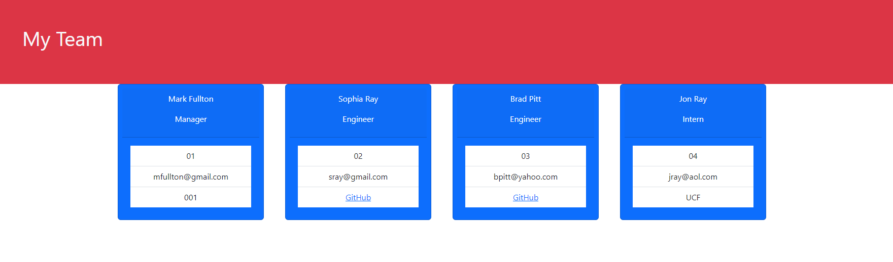

# Team-Profile-Generator

## Description
As a user who wants to generate a page that displays all of the employees of their company, and have each employee display with important information about each employee.  

## Installation
To run this application:
* Please right click on index.js
* Select Open in Integrated Terminal.  
* Once the terminal opens, please type into the terminal npm i (this installs the npm package required for the application to run)
* After the NPM has installed, please enter: node index.js
* Follow the prompts and enter your employees sorted by Manager, Engineer, or Intern.

## Tests
In order to access all tests written for this application, please select the folder labelled as tests.

## Demonstration
https://drive.google.com/file/d/1UCZK3SR0uOViI1Z94et28eAI2GusJc1M/view
## Screen Shot

## Live Link
